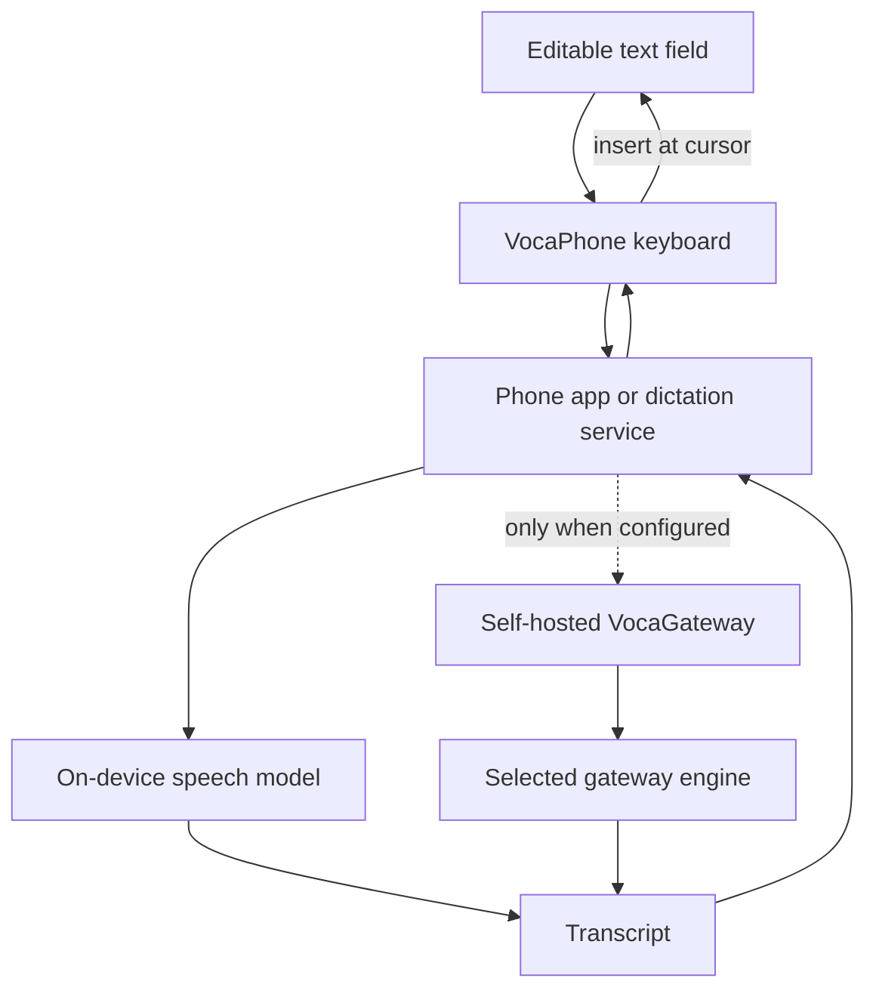

# What VocaPhone is

VocaPhone is a voice keyboard for iPhone and Android. You speak into the phone
and the transcript is inserted at the cursor in the text field you are already
using.

Speech-to-text runs on the phone after a model download by default. An optional
self-hosted VocaGateway can run transcription on a Mac, Linux machine, or home
server that you control when you want a larger model or shared compute. There is
no Voca-hosted speech-to-text service in the path.

## Supported clients

| Client | Status | Install or build path |
| --- | --- | --- |
| Android | Google Play for Android 13+ | [Google Play](https://play.google.com/store/apps/details?id=com.vocahq.vocaphone) or [Android development setup](../how-to/development-setup.md#android-build-and-install-locally) |
| iPhone | Public TestFlight beta for iOS 17+ | [TestFlight](https://testflight.apple.com/join/wd85wQ3W) or [physical iPhone setup](../how-to/device-setup.md) |
| VocaGateway | Optional self-hosted service | [Deploy a gateway](../how-to/deploy-gateway.md) |

## The product boundary

The two transcription routes share the same user-visible result. The gateway
route is explicit: audio leaves the phone only when the user configures the
gateway URL and token.

## iPhone and Android boundaries

On iPhone, the containing app owns the microphone because an iOS keyboard
extension cannot record audio. The app and keyboard coordinate through a
versioned App Group session record, and the keyboard inserts through
`UITextDocumentProxy`.

On Android, the IME uses a microphone foreground service and inserts through
`InputConnection`. It does not use clipboard insertion for dictation and it
does not read surrounding text for the transcription request. Sensitive input
types disable dictation.

## Product capabilities

- Dictation inserts at the active cursor in an editable field.
- On-device speech-to-text works after downloading a compatible model.
- VocaGateway supports optional shared or larger-model compute on hardware the
  user operates.
- The clients support multiple transcription languages and writing styles where
  the selected model supports them.
- The phone can clean up hesitation sounds, false starts, repeated words, and
  missing sentence punctuation locally when that setting is enabled.
- Android provides a normal keyboard with suggestions, swipe typing, emoji, a
  clipboard chip, and configurable keyboard layout options.
- iOS provides a custom keyboard, Quick Dictation coordination, suggestions,
  corrections, predictions, swipe typing, and emoji search.

## Privacy boundary

The successful audio path is short-lived. The phone records in app-private
storage, sends audio only to the selected route, receives the transcript, and
deletes successful audio. A failed session can retain audio for a bounded retry
window so the user can recover without recording again.

The gateway uses bearer authentication, bounded uploads, private-by-default
binding, and privacy-safe operational counters. It does not log recordings,
transcripts, tokens, or typed text. Optional usage reporting is off until the
user enables it and sends closed-vocabulary counters to VocaHQ's self-hosted
Aptabase instance; it is not transcription telemetry.

Read [Privacy and data handling](../reference/privacy.md) for retention,
keyboard access, gateway transport, diagnostics, and usage reporting details.

## Project family and license

VocaPhone is part of the Voca family alongside
[VocaLinux](https://github.com/VocaHQ/vocalinux),
[VocaMac](https://github.com/VocaHQ/vocamac), and
[VocaWin](https://github.com/VocaHQ/vocawin). VocaPhone is licensed under the
[GNU Affero General Public License v3.0](https://github.com/VocaHQ/vocaphone/blob/main/LICENSE).
