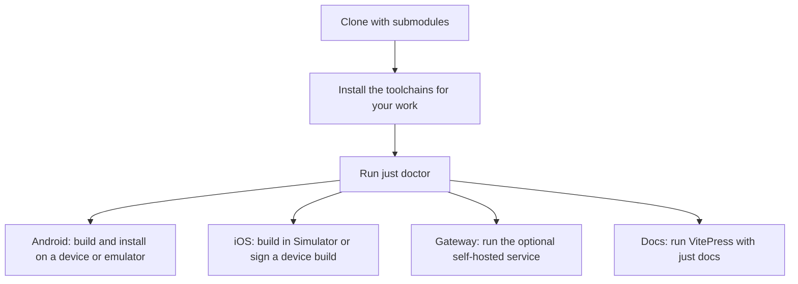
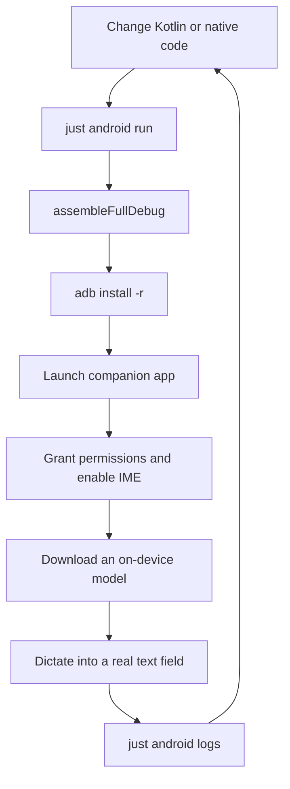
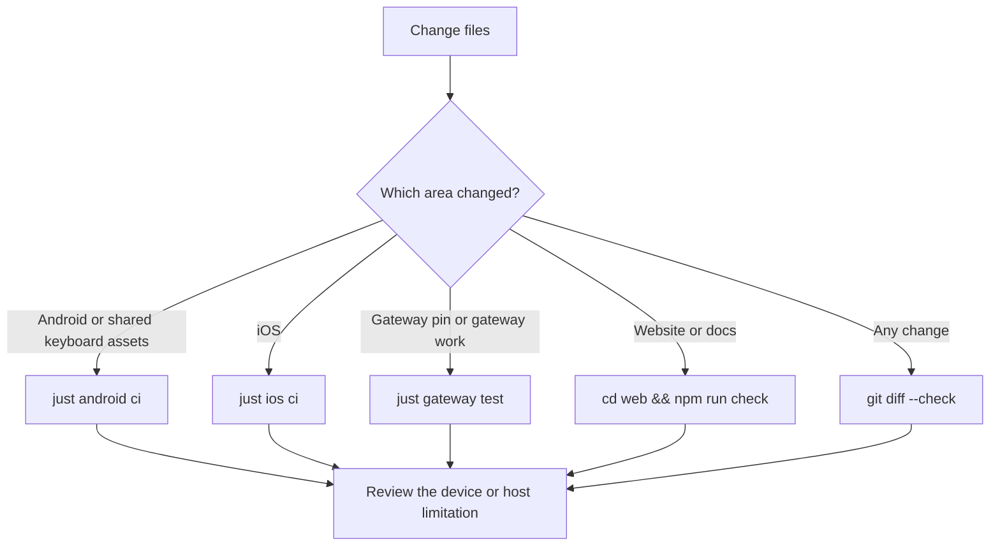

# Set up a VocaPhone development environment

Use this guide when you want to build VocaPhone from source, install the
Android app locally, run the iOS app in a simulator, work on the optional
gateway, or edit the documentation site.

VocaPhone has three application toolchains. Install only the toolchains you
need; the root `just` commands skip toolchains that are not present.



## Before you start

### Clone the repository

The repository contains pinned submodules, including the Android native engine
source and the optional gateway. Clone them with the repository:

```sh
git clone --recurse-submodules https://github.com/VocaHQ/vocaphone.git
cd vocaphone
```

For an existing clone, initialize or refresh them with:

```sh
git submodule update --init --recursive
```

The gateway is a pinned checkout of
[VocaHQ/vocagateway](https://github.com/VocaHQ/vocagateway). Gateway-only
features and fixes belong in that repository; this repository records the
gateway revision that VocaPhone uses.

### Install the shared tools

| Tool | Used for | Required when |
| --- | --- | --- |
| Git | Source and submodules | Always |
| [`just`](https://just.systems) | Repository commands | Always recommended |
| Python 3 | Shared asset checks and helper scripts | Android checks or full CI |
| Node.js and npm | Documentation site | Documentation work |
| Xcode and XcodeGen | iOS app and keyboard | iOS work on macOS |
| JDK 21 | Android compilation | Android work |
| Android Studio and SDK | Android build, emulator, and `adb` | Android work |
| `uv` and FFmpeg | Native gateway | Gateway work |
| Docker Compose | Container gateway | Container gateway work |

Run the repository doctor after installing what you need:

```sh
just doctor
just --list
```

`just doctor` reports all three application toolchains and exits successfully
when an unrelated toolchain is absent. The platform-specific doctors are
stricter: `just android doctor` and `just ios doctor` fail when their own
requirements are missing.

## Android: build and install locally

Android development uses the `full` flavor. It includes the normal local
engines and the prebuilt sherpa-onnx JNI libraries. The `fdroid` flavor is a
whisper.cpp-only, from-source build for F-Droid and is not the everyday
development target.

### Install the Android toolchain

Install Android Studio, then use **SDK Manager** to install:

- Android SDK Platform 37
- Android SDK Platform-Tools, including `adb`
- CMake 3.22.1
- NDK 27.2.12479018

VocaPhone compiles with **JDK 21 exactly**. The Gradle configuration can
provision a Gradle daemon JDK, but keeping JDK 21 on your `PATH` also makes
local tools and reproducible builds agree with the F-Droid build environment.

Set the SDK path if Android Studio has not created
`android/local.properties` for you:

```sh
# macOS
export ANDROID_HOME="${ANDROID_HOME:-$HOME/Library/Android/sdk}"

# Linux alternative
# export ANDROID_HOME="${ANDROID_HOME:-$HOME/Android/Sdk}"
```

You can also install the command-line components with `sdkmanager`:

```sh
sdkmanager "platform-tools" "platforms;android-37" \
  "cmake;3.22.1" "ndk;27.2.12479018"
```

Check the result:

```sh
just android doctor
```

### Prepare a phone or emulator

Use an Android 13 or newer device. A physical phone needs **Developer options**
and **USB debugging** enabled. For an emulator, create and boot an API 33 or
newer system image in Android Studio.

List attached devices before installing:

```sh
just android devices
```

If more than one device is ready, choose one explicitly:

```sh
ANDROID_SERIAL=emulator-5554 just android run
```

### Build, install, and launch

From the repository root, the normal development command is:

```sh
just android run
```

This assembles `fullDebug`, installs
`com.vocahq.vocaphone`, and launches the companion app. Grant the runtime
permissions after installation:

```sh
just android permissions
```

Then complete the in-app setup:

1. Enable **VocaPhone** in Android's keyboard or input-method settings.
2. Select VocaPhone as the current keyboard in an editable text field.
3. Allow microphone and notification access if Android has not already granted
   them.
4. Open **Speech** and select **On this phone**.
5. Download a model with **Download and use**.
6. Open Notes or another ordinary text field, tap **Dictate**, speak, and tap
   **Finish**.

The first local transcription stays on the phone. A gateway is optional and
is only used after you configure one in the app.

The lower-level commands are useful when you need to inspect an APK directly:

```sh
cd android
./gradlew assembleFullDebug
adb install -r app/build/outputs/apk/full/debug/vocaphone-fullDebug.apk
```

If an older Local Flow build is installed, remove its old application ID before
installing VocaPhone:

```sh
adb uninstall io.github.mrsunglasses.localflow 2>/dev/null || true
```

The local Android loop looks like this:



### Android checks and debugging

Run the same checks used by the Android quality workflow:

```sh
just android ci
```

For a shorter loop, use:

```sh
just android test             # unit tests
just android lint             # Android Lint
just android logs             # running app's logcat
just android clean            # remove Gradle output
```

The Android quality gate also checks the checked-in Room schema and native APK
page alignment. Keyboard, microphone, bubble, or insertion changes still need
a physical-device note in the change review.

### Android build flavors

| Flavor | Includes | Use |
| --- | --- | --- |
| `full` | whisper.cpp and sherpa-onnx | Development, GitHub beta builds, and Google Play |
| `fdroid` | whisper.cpp compiled from source | F-Droid reproducible builds |

Every Gradle task names its flavor. Examples:

```sh
./gradlew assembleFullDebug
./gradlew testFullDebugUnitTest
./gradlew lintFullDebug
```

## iOS: simulator and device development

iOS development requires macOS, Xcode, XcodeGen, and an iOS 17 or newer
simulator runtime. The source of truth is `ios/project.yml`; the generated
`ios/VocaPhone.xcodeproj` is checked in for CI and regenerated by the iOS
recipes.

```sh
just ios doctor
just ios run
```

The simulator path does not need an Apple account. To add the keyboard in the
simulator, run `just ios settings`, then open **General → Keyboard → Keyboards
→ Add New Keyboard → VocaPhone** and enable **Allow Full Access**.

For a connected iPhone, signing must already work in Xcode:

```sh
just ios device
```

Contributors using a personal Apple team can create local, gitignored signing
overrides with `just ios local-signing <team-id> <reverse-dns-prefix>`. Do not
commit personal team IDs, bundle IDs, App Groups, or provisioning material.

After changing `ios/project.yml`, regenerate and commit the project:

```sh
just ios gen
```

The first build downloads the pinned Swift packages, including Sherpa ONNX.
`just ios fetch` only prefetches those packages.

## Optional gateway development

On-device transcription is the default and needs no gateway. For gateway work,
initialize the submodule, install its dependencies, and run its checks:

```sh
git submodule update --init --recursive
just gateway install
just gateway run
just gateway test
```

The gateway can run natively on macOS or Linux, or through Docker Compose. Keep
the listener private by default, use a bearer token, and follow the [gateway
deployment guide](deploy-gateway.md) and [Tailscale guide](tailscale.md) before
connecting a phone.

Gateway implementation changes belong in
[VocaHQ/vocagateway](https://github.com/VocaHQ/vocagateway). This repository
only records the pinned submodule revision. Use `just gateway-sync` for local
experimentation and commit a submodule pin only when VocaPhone should adopt a
new gateway revision.

## Documentation site development

The documentation source lives in the repository-level `docs/` directory. The
separate VitePress build tool in `docs-site/` publishes it at `/docs/`, while
the dependency-free marketing site stays in `web/`.

```sh
just docs
```

Open [http://127.0.0.1:5173/docs/](http://127.0.0.1:5173/docs/). The server
reloads when you edit Markdown or site configuration.

Install the documentation build tools once before using the docs commands:

```sh
cd docs-site
npm ci
```

Run the full web gate before submitting documentation changes:

```sh
cd web
npm run check
```

The check validates the public site and builds every documentation route,
including Mermaid diagrams. The permanent docs site is static; it does not
require a server-side runtime after the build.

## Optional `direnv`

[`direnv`](https://direnv.net) is optional. If it is installed, run:

```sh
direnv allow
```

The checked-in `.envrc` adds the gateway virtual environment and Android
`platform-tools` to `PATH` and exports `ANDROID_HOME`. Machine-specific values
belong in the gitignored `.envrc.local`, for example:

```sh
export VOCAPHONE_SIM='iPhone 17 Pro'
export ANDROID_SERIAL=emulator-5554
```

Do not source `gateway/.env` into your shell. It contains the Compose bearer
token; Compose reads it itself.

## Run the appropriate checks



The root command runs every available leg and skips missing toolchains:

```sh
just ci
```

Keep the pull request focused, state which checks were skipped and why, and do
not include recordings, transcripts, tokens, real gateway addresses, signing
files, or local database files.

## Repository layout

| Path | Owns |
| --- | --- |
| `android/` | Kotlin keyboard, foreground microphone service, on-device engines, and tests |
| `ios/` | Swift app, keyboard extension, Live Activity, shared App Group state, and tests |
| `gateway/` | Pinned VocaGateway checkout |
| `assets/keyboard/` | Shared word list, bigrams, emoji catalog, and suggestion data |
| `docs/` | Tutorials, how-to guides, architecture, privacy, and reference material |
| `web/` | Static marketing site and VitePress build configuration |
| `telemetry/` | Optional self-hosted usage counters, never speech-to-text |

Read [Contribute to VocaPhone](contribute.md) before opening a change. It
covers worktrees, review boundaries, required checks, and information that must
never enter a commit.
